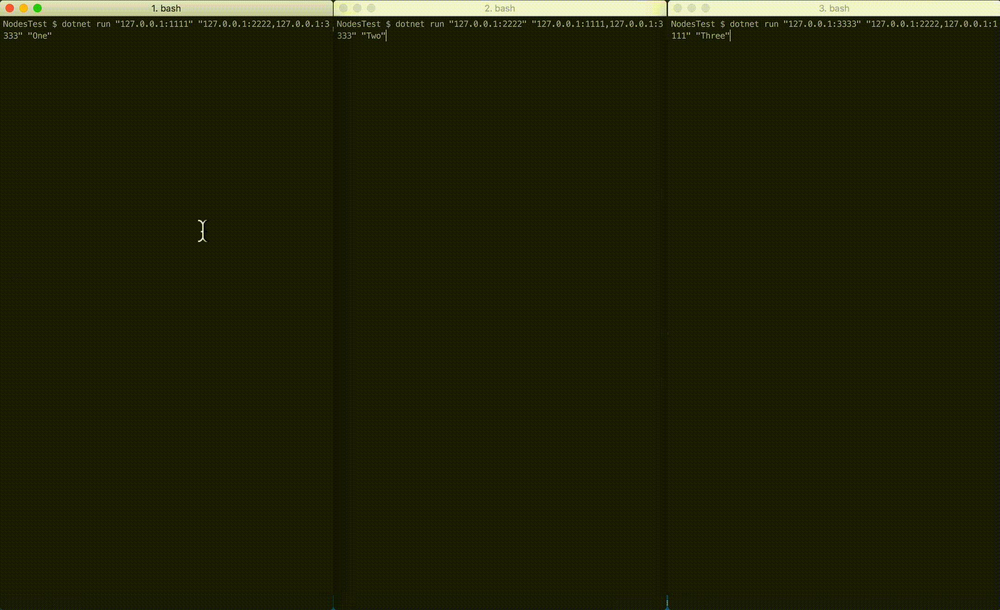

# Part IV: Implementation of Consensus

## **Table Of Contents**

1. [Implementing Consensus Based On Failure Detectors](#Implementing-Consensus-Based-On-Failure-Detectors)
2. [Chandra-Toueg Consensus](#Chandra-Toueg-Consensus)
3. [Run And Experiment](#Run-And-Experiment)

## **Implementing Consensus Based On Failure Detectors**

### **Chandra-Toueg Consensus**

Chandra-Toueg consensus is based on strong or eventually stong failure detectors. It operates in asynchronous environment and can tolerate number of failures `f` equals to `N/2 - 1` where `N` is overall number of nodes in a distributed system.

The algorithm operates in rounds. In each round, one of the nodes is designated as a Coordinator, computed by the formula `R mod N`, where `R` is round number. For example, in a system with three nodes, in the first round, second node will be a Coordinator (index one). In the second round, third node will be a Coordinator (index two). In the third round, first node will be a coordinator (index zero), etc.

When there are no Coordinator failures encountered, the algorithm terminates in a single round. When there's a failure of the Coordinator encountered, the algoritm proceeds to the next round, and chooses a new Coordinator until there is no Coordinator failure.

The algorithm needs the following messages to operate:

```fsharp
namespace Node

module Consensus =

    type ConsensusPreference = {
        round: int
        preference: obj
        timestamp: int64
    }

    type ConsensusCoordinatorPreference = {
        round: int
        preference: obj
    }

    type ConsensusPositiveAcknowledgement = {
        round: int
    }

    type ConsensusNegativeAcknowledgement = {
        round: int
    }

    type ConsensusDecide = {
        preference: obj
    }

    type RequestConsensus = {
        round: int
    }
```

`ConsensusPreference` can be sent by each node and received by the Coordinator.
When a node received `ConsensusPreference` message, it means others see it as the Coordinator. Coordinator will track the message and once it received `ConsensusPreference` messages from majority of nodes, it will choose the `ConsensusPreference` message with the latest timestamp, and send it as `ConsensusCoordinatorPreference` message to everyone.

When a node receives `ConsensusCoordinatorPreference`, it sends `ConsensusPositiveAcknowledgement` to the Coordinator, and sets `Decision` value to the Coordinator Preference.

When a node received `ConsensusPositiveAcknowledgement` message from a neighbor, it means that neighbor sees it as the Coordinator, and agrees to the preference previously sent by the Coordinator. The Coordinator waits to receive `ConsensusPositiveAcknowledgement` messages from the majority of neighbors, and sends `ConsensusDecide` message to everyone.

When a node receives a `ConsensusDecide` message, that means it's completely ready to set the value to the one that has been sent within the `ConsensusDecide` message.

If node's failure detector found a failure of some neighbor, the node checks if the crashed neighbor is a Coordinator. If so, it sends a `ConsensusNegativeAcknowledgement` to the Coordinator, increases the round number and proposes the value to the new Coordinator.


```fsharp
module Consensus =

    // ...

    type ChandraTouegConsensus (server: NetworkServer, node, neighbors, initialValue) =

        // ...

        member val Value = initialValue with get, set
        member val Round = 0 with get, set
        member val Decision = initialValue with get, set
        member val ReceivedPreference = // ...
        member val ReceivedPositiveAcknowledgement = // ...
        member val ReceivedNegativeAcknowledgement = // ...

        member x.GetCoordinator round =
            let coordinatorIndex = round % (x.Neighbors.Count + 1)
            let orderedNodes = Seq.sort (x.Node::List.ofSeq x.Neighbors)
            let coordinator = orderedNodes |> Seq.item coordinatorIndex
            coordinator

    member x.ReceiveMessage (message: obj) = async {
            match message with
            | :? ConsensusPreference as preference ->
                do! x.HandlePreference preference
                return true
            | :? ConsensusCoordinatorPreference as coordinatorPreference ->
                do! x.HandleCoordinatorPreference coordinatorPreference
                return true
            | :? ConsensusPositiveAcknowledgement as ack ->
                do! x.HandlePositiveAcknowledgement ack
                return true
            | :? ConsensusNegativeAcknowledgement as nack ->
                do! x.HandleNegativeAcknowledgement nack
                return true
            | :? ConsensusDecide as decision ->
                do! x.HandleDecide decision
                return true
            | :? RequestConsensus ->
                do! x.StartConsensus ()
                return true
            | _ -> return false
        }

      member x.StartConsensus () = async {
              x.Round <- x.Round + 1

              let proposal: ConsensusPreference =
                  {
                      round = x.Round
                      preference = x.Value
                      timestamp = DateTimeOffset.UtcNow.ToUnixTimeMilliseconds()
                  }

              let newCoordinator = x.GetCoordinator x.Round

              if newCoordinator = x.Node then do! x.HandlePreference proposal
              else do! x.server.SendMessage proposal newCoordinator.host newCoordinator.port
          }

        member x.HandlePreference (preference: ConsensusPreference) = async {
            if x.ReceivedPreference.ContainsKey preference.round then
                x.ReceivedPreference.[preference.round] <- preference::x.ReceivedPreference.[preference.round]
            else x.ReceivedPreference.[preference.round] <- [preference]

            if x.ReceivedPreference.[preference.round].Length >= ((x.Neighbors.Count + 1) / 2) + 1 then
                let latestTimestampPreference =
                    x.ReceivedPreference.[preference.round]
                    |> List.maxBy (fun p -> p.timestamp)
                let coordinatorPreference: ConsensusCoordinatorPreference =
                    {round = latestTimestampPreference.round; preference = latestTimestampPreference.preference}
                for n in x.Neighbors do
                    do! x.server.SendMessage coordinatorPreference n.host n.port
                do! x.HandleCoordinatorPreference coordinatorPreference
        }

        member x.HandleCoordinatorPreference (coordinatorPreference: ConsensusCoordinatorPreference) = async {
            let ack: ConsensusPositiveAcknowledgement = {round = coordinatorPreference.round}
            let coordinator = x.GetCoordinator coordinatorPreference.round
            if coordinator = x.Node then do! x.HandlePositiveAcknowledgement ack
            else do! x.server.SendMessage ack coordinator.host coordinator.port
            x.Decision <- coordinatorPreference.preference
        }

        member x.HandlePositiveAcknowledgement (ack: ConsensusPositiveAcknowledgement) = async {
            if x.ReceivedPositiveAcknowledgement.ContainsKey ack.round then
                x.ReceivedPositiveAcknowledgement.[ack.round] <- ack::x.ReceivedPositiveAcknowledgement.[ack.round]
            else
                x.ReceivedPositiveAcknowledgement.[ack.round] <- [ack]

            if x.ReceivedPositiveAcknowledgement.[ack.round].Length >= ((x.Neighbors.Count + 1) / 2) + 1 then
                let latestTimestampPreference = x.ReceivedPreference.[ack.round] |> List.maxBy (fun p -> p.timestamp)
                let decide: ConsensusDecide = { preference = latestTimestampPreference }
                for n in x.Neighbors do do! x.server.SendMessage decide n.host n.port
                do! x.HandleDecide decide
        }

        member x.HandleNegativeAcknowledgement (nack: ConsensusNegativeAcknowledgement) = async {
            if x.ReceivedNegativeAcknowledgement.ContainsKey nack.round then
                x.ReceivedNegativeAcknowledgement.[nack.round] <- nack::x.ReceivedNegativeAcknowledgement.[nack.round]
            else
                x.ReceivedNegativeAcknowledgement.[nack.round] <- [nack]

            if x.ReceivedNegativeAcknowledgement.[nack.round].Length >= ((x.Neighbors.Count + 1) / 2) + 1 then
                do! x.ClearState ()
        }

        member x.HandleDecide (decision: ConsensusDecide) = async {
            x.Value <- decision.preference
            do! x.ClearState ()
        }

        member x.DetectedFailure (neighbor: Neighbor) = async {
            if x.GetCoordinator x.Round = neighbor then
                let nack: ConsensusNegativeAcknowledgement = {round = x.Round}
                do! x.server.SendMessage nack neighbor.host neighbor.port
                do! x.StartConsensus ()
        }

        // ...
```

Take a look at `Consensus.fs` for more details.

#### How Chandra-Toueg Consensus Algorithm Works



## Run And Experiment

To run the distributed systems, learn about how failure detectors and consensus work, open `Program.fs` and experiment with the settings.

```fsharp
// ...

let messageHandling message = async {
    printfn "User message handling here..."
}

let startConsensus (node: Node) = async {
    // Start consensus after 10 seconds
    do! Async.Sleep 10000
    do! node.StartConsensus ()
}

let getHostAndPort (address: string) =
    let hostport = address.Split([|':'|])
    { host = hostport.[0]; port = int hostport.[1] }

[<EntryPoint>]
let main argv =
    printfn "Hello from the F# Distributed System!"

    let printUsage () =
        printfn "USAGE:"
        printfn "First argument is host and port to run this node on."
        printfn "Second argument is a comma separated list of hosts and ports of the neighbors."
        printfn "Third argument is a default value to start the node with."
        printfn """Example: dotnet run "127.0.0.1:1234" "127.0.0.1:1235,127.0.0.1:1236" "Value" """
    if argv.Length = 0 then
        printUsage ()
    else
        if argv.Length < 1 || argv.Length > 3 then
            printUsage()
        else
            let nodeInput = Array.get argv 0
            let node = getHostAndPort nodeInput

            let startingValueConf, neighborsConf =
                match argv.Length with
                | 1 -> ("Default", [])
                | 2 ->
                    let neighborsInput = Array.get argv 1
                    let neighbors = neighborsInput.Split([|','|]) |> Seq.map getHostAndPort |> Seq.toList
                    ("Default", neighbors)
                | 3 ->
                    let neighborsInput = Array.get argv 1
                    let neighbors = neighborsInput.Split([|','|]) |> Seq.map getHostAndPort |> Seq.toList
                    (Array.get argv 2, neighbors)
                | _ -> failwith "This shouldn't ever happen."

            printfn "Starting Node %s:%i..." node.host node.port

            let nodeInstance = Node.Node(node.host, node.port, startingValueConf)
            let nodeConfiguration = {
                networkProtocol = UDP // or TCP
                failureDetector = HeartbeatSuspectLevel // or PingAck,
                                                        // SimpleHeartbeat,
                                                        // HeartbeatRecovery,
                                                        // HeartbeatSlidingWindow,
                                                        // HeartbeatSuspectLevel
                consensus = ChandraToueg
                receiveMessageFunction = messageHandling
                neighbors = neighborsConf
                gossipping = true // or false
                verbose = false  // or true
            }

            nodeInstance.InitializeNode(nodeConfiguration) |> Async.RunSynchronously
            nodeInstance.Start |> Async.RunSynchronously

            // Uncomment to experiment with consensus
            // nodeInstance |> startConsensus |> Async.RunSynchronously

            Thread.Sleep 600000
            0
```

Keep in mind, this is not a bullet-proof distributed system, do not use it in prodiction. It is for illustrative and educational purposes only.

To run the example, make sure you specified the configuration setting you prefer, open several terminals, and start the project in each of them:

```bash
dotnet run \
    "nodehost:nodeport" \
    "neighbor1host:neighbor1port,neighbor2host:neighbor2port,neighborNhost:neighborN:port" \
    "value"
```

Make sure to replace the host, port, and value with your own information.

To stop any of the projects press `Ctrl+C` in the terminal.

To build the solution, go to the `src` directory and execute `build-fsharp.sh` (for Linux and Mac).

## I hope you enjoyed the series!