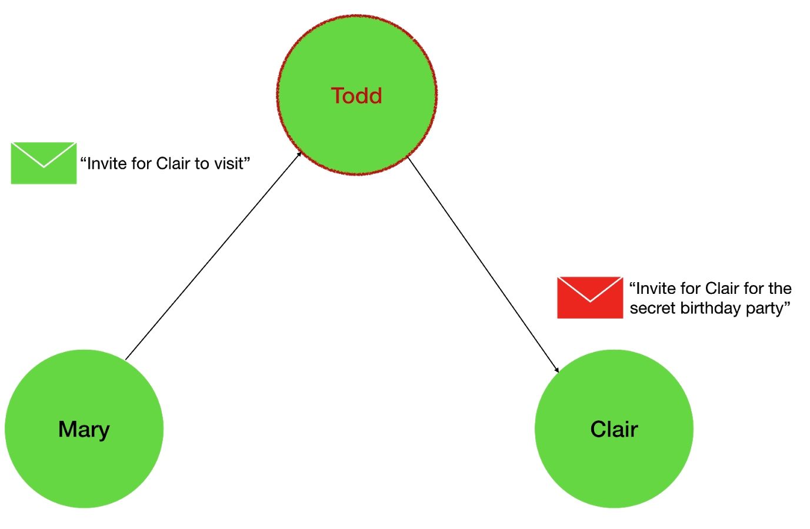

# Part I: Theory behind Failure Detectors

## **Table Of Contents**

1. [Failure Detectors](#Failure-Detectors)
2. [Failures Are Everywhere](#Failures-Are-Everywhere)
3. [Discovering Failures](#Discovering-Failures)
4. [Failure Detectors Of The Real World](#Failure-Detectors-Of-The-Real-World)
5. [Problems Solved With Failure Detectors](#Problems-Solved-With-Failure-Detectors)
6. [Properties Of A Failure Detector](#Properties-Of-A-Failure-Detector)
7. [Types Of Failure Detectors](#Types-Of-Failure-Detectors)
8. [Failure Detectors In Asynchronous Environment](#Failure-Detectors-In-Asynchronous-Environment)
9. [Reducibility Of Failure Detectors](#Reducibility-Of-Failure-Detectors)

## **Failure Detectors**

According to a common definition, a distributed system is a group of computers working together that appears to the client as a single computer. Beyond this seemingly simple definition, there are some challenges to overcome to provide reliable operation. There are many things that happen behind the scenes that might violate the smooth functioning of a distributed system. A lot of the issues are caused by the distributed and asynchronous nature of the environment.

Imagine a system that stores data evenly distributed between nodes, where each node is responsible for a certain range of data. A client can send a request to the system, and it can land on any node. Let’s call the node that received the request a _coordinator_. After receiving the request, the coordinator’s mission is to fulfill it, either alone, or working together with other nodes. In our example system, each node knows what range of data it and other nodes are responsible for storing. This way when a coordinator receives a request, it already knows which node to contact to provide the response.

If our distributed system stored data about grocery products, the client could decide to request more information about the product with the name “Sweet Tea” produced by a certain manufacturer. The coordinator would look at the key parts of data in the client’s request, and figure out that all data about tea products and this specific manufacturer is the responsibility of some node. Let’s call it the _main data node_ in this example. The coordinator will ask the main data node to provide information about what the client requested. In the perfect world, the main data node will provide a reply, and the coordinator will successfully return it to the client. In reality, there might be issues with the availability of nodes in the distributed system, such as _node crashes_ or _failures_. If the system isn’t redundant, and the coordinator doesn’t have a backup plan and tries to get information from the crashed node, it will likely have wait until the crashed node comes back up. This might take a very long time, and most clients won’t be thrilled to wait forever.

Our systems won’t be responsive and reliable if they don’t know how to detect and get around possible failures that are common in the real world.

There is a need for a mechanism that would help each node in the system to detect when crucial components are not working. The client doesn’t necessarily care whether the main data node is up or down, it still expects the answer from the distributed system.

Every system is different, but in most of them, we need to be ready to face failures and have a plan on dealing with failures. To do that, we need to understand different kinds of failures.

## **Failures Are Everywhere**

Ignoring a chance of failure instead of facing the reality of it is one of the mistakes we can avoid when designing a new distributed system. Thinking that a specific type of failure isn’t likely to happen is a bold assumption that needs to be thoroughly evaluated. Some types of failures are less frequent than others. Some of them are rare but can lead to greater damage in your system.

A system can encounter _value failures_ and _timing failures_. Failures can be consistent and _inconsistent_, _persistent_ and _intermittent_. There are many ways to classify failures in a distributed system.

_Value failures_ happen when a node intentionally sends incorrect information in reply to another node. Imagine Mary sends a message to Todd asking him to invite their best friend Clair for a visit. Mary also warns him not to tell Clair it’s about the surprise party for her birthday. Then imagine, Todd replies to Mary confirming the promise to keep the party a surprise and immediately calls Clair to reveal the secret. Todd’s wrong behavior is a _value failure_. This isn’t what Mary expected from Todd, and Mary still thinks Clair doesn’t know anything about the surprise.

_Timing failures_ happen when a node doesn’t provide a response within the expected timeframe. A timing failure could happen if Mary decided to order a cake for Clair’s birthday, and haven’t received it after two weeks of waiting, even though the bakery promised to deliver it within a two week period.

A failure is consistent when every node experiences the failure the same way. A failure is inconsistent when different nodes perceive the failure differently, for example, one node may experience it, and another node may have no issues.

A **_failure mode_** is a variation in which a distributed system can fail. Let’s cover several failure modes we commonly work with.

_Performance Failures_ happen when the nodes don’t experience _value failures_ but have _timing failures_, and are delivering responses outside the time frame expected by the system. A performance failure would happen if Todd kept a promise he gave to Mary to invite Clair for a visit, but forgot to actually do that on time and Clair missed the surprise birthday party.

_Byzantine Failures_ occur when some nodes misbehave by intentionally stating that the correct value is incorrect, or vice versa. For example, a node having a Byzantine failure may point other nodes to the false leader. Todd was affected by a Byzantine failure when he was intentionally passing the wrong information to Clair.

### _Diagram - Byzantine Failure Example_

_Authenticated Byzantine Failures_ are similar to Byzantine Failures, with one distinction. Here a node can’t forge messages it received from others, whereas with regular Byzantine Failures it can. If Todd was affected by an Authenticated Byzantine Failure instead of general Byzantine Failure, he wouldn’t be able to corrupt the requests he received from Mary or anyone else and pass the incorrect message to Clair. He would still be able to pass wrong and misleading information to his friends as long as he himself is the source of the information.

_Omission Failures_ result from one or more failed attempts when communicating with a node. Failure to send or receive messages is an omission failure. An omission failure could happen when the bakery actually sent the cake to Mary, but it got lost or eaten by the hungry delivery person on the way from the bakery to Mary’s house.

_Crash Failures_ happen after all attempted interactions with a node result in omission failures. If a node fails by stopping because of power outages, software or hardware errors, or other reasons, and other nodes don’t find out of the fail - it’s a crash failure. In other words, there a crash failure when a node completely fails to respond. If the bakery building caught on fire and Mary didn’t know about it, that would be a crash failure which would explain why Mary didn’t receive the cake from the bakery, and every single attempt to contact the bakery to ask about the cake, or order a new cake failed.

_Fail-Stop Failures_ are similar to Crash Failures, with a difference that all correctly-functioning nodes can detect and learn about the failure of the specific failed node.

## **Discovering Failures**

**_Failure detectors_** is one of the essential techniques to discover _node crashes or failures_ in a distributed system. It helps processes in a distributed system to change their action plan when they face such failures.

For example, failure detectors can help the coordinator node avoid the unsuccessful attempt of requesting data from a node that crashed. With failure detectors, each node will know if any other nodes in the cluster crashed. Having this useful information, each node has the power to decide what to do in case of the detected failures of other nodes. For example, instead of contacting the main data node, the coordinator node could decide to contact one of the healthy secondary replicas of the main data node and provide the response to the client.

Failure detectors don’t guarantee the successful execution of client requests. Failure detectors are important, as they help nodes in the system to be aware of known crashes of other nodes and avoid continuing the path of failure. Failure detectors collect and provide information about node failures, and it’s up to the distributed system logic to decide how to use it. If the data is stored redundantly across several nodes, the coordinator can choose to contact alternative nodes to execute the request. In other cases, there might be failures that could affect all replicas, then the client request isn’t guaranteed to succeed.

## **Failure Detectors Of The Real World**

To draw the parallel with the real world, imagine a network of coffee supply locations, where each store carries and sells a rotating variety of coffee beans in large amounts. You can think of each coffee location as a _node_ in the distributed system. Each supply location stores coffee beans in smart containers with sensors that track the bean levels to tell how much coffee is left for each type of coffee. Supply locations continuously exchange this information and every coffee store knows the status of all the other stores.

One day, Clair decided to stop by one of the coffee locations called _Coordinator Coffee_. You can think of it as a _coordinator_ node in a distributed system. Clair wanted to get some of her favorite coffee beans called the _best coffee beans_. The store assistant at _Coordinator Coffee_ found that this particular supply location doesn’t carry the _best coffee beans_ anymore, but the _Main Best Coffee_ is now the main location Clair could get her favorite coffee beans at. What Clair doesn’t know about is that _Main Best Coffee_ store location had a sudden power outage and had to close early for the day. Good thing all the coffee locations are exchanging data about their status, which acts as a coffee store _failure detector_. Because_ Main Best Coffee_ stopped sending the coffee sensor data, all the other locations including the _Coordinator Coffee_ started suspecting that _Main Best Coffee_ might be unavailable. Based on the data from the coffee failure detection system, the _Coordinator Coffee_ assistant recommended Clair should skip the _Main Best Coffee_ and go straight to another Good Coffee store that carries the _best coffee beans_ and is open.

### _Diagram - Failure Detection Of The Real World_

The mechanism for making each distributed system node aware of other node crashes is a failure detector. Failure detectors discover node crashes and help improve the reliability of the distributed system. After the system is aware of the discovered crashes, it will aim to get around them to avoid further failures.

## **Problems Solved With Failure Detectors**

Many distributed algorithms rely on failure detectors. Even though failure detectors can be implemented as an independent component and used for things like reliable request routing, failure detectors are widely used internally for solving agreement problems, consensus, leader election, atomic broadcast, group membership, and other distributed algorithms.

Failure detectors are substantial for consensus and can be applied to improve reliability and help distinguish between nodes that have delays in their responses and those that crashed. Consensus algorithms can benefit from using _failure detectors_ that _estimate_ which nodes have crashed, even when the estimate isn’t a hundred percent correct.

Failure detectors can improve atomic broadcast, the algorithm that makes sure messages are received in the same order by every node in a distributed system. It’s common for atomic broadcast to use group membership algorithms to overcome failures. Unreliable failure detectors can be a significant optimization for the atomic broadcast in certain environments. A mistake made by the group membership algorithm could have a greater resulting cost than a mistake made by a failure detector. When a group membership algorithm detects a node crash, it needs to remove the failed node from the network to make sure the system isn’t blocked. Often there’s a need to replace the crashed node with a new one. These two are expensive operations in a distributed system. Unreliable failure detectors can be more efficient for atomic broadcast than group membership when incorrect _failure suspicions_ (studied in the next section) are common. However, systems with an unlimited number of faulty nodes still prefer to rely on group membership algorithms instead of failure detectors for greater reliability.

Failure detectors can also be used to implement group membership algorithms, detectors, and in k-set agreement in asynchronous dynamic networks.

## **Properties Of A Failure Detector**

In the account of differences in the nature of environments our systems run in, there are several types of failure detectors we can use. What makes them different?

In a synchronous system, a node can always determine if another node is up or down because there’s no nondeterministic delay in message processing.

In an asynchronous system, we can’t make an immediate conclusion that a certain node is down if we didn’t hear from it. What we can do is start **_suspecting_** it’s down. This gives the suspected failed node a chance to prove that it’s up and didn’t actually fail, just taking a bit longer than usual to respond. After we gave the suspected node enough chances to reappear, we can start **_permanently suspecting it_**, making the conclusion that the target node is down.

### _Diagram - Suspecting Failures_

Can we discover _all_ the failures? How precise can we be in our failure suspicions?

The answers to these questions can be different, which is why there are different types of failure detectors offering different guarantees.

**_Completeness_** is a property of a failure detector that helps measure whether some or all of the correctly-functioning nodes discovered each of the failed nodes. What are possible variations of completeness when working with failure detectors? How do we measure whether a failure detector has a _strong_ or _weak_ completeness property?

When every correctly-operating node _eventually_ discovers every single failed node, it indicates that the failure detector has strong completeness. Eventually, because a node can first suspect another node to have possibly failed for a while, before marking it as permanently suspected.

**_Strong completeness_** property means that every node will eventually permanently suspect all the failed nodes.

**_Weak completeness_** means that some nodes will eventually permanently suspect all the failed nodes.

### _Diagram - Strong Completeness_

  a.  All nodes are healthy.

  b.  Nodes 2 and 3 crashed.

  c.  The rest of the nodes  eventually notice the all crashed nodes.

### _Diagram - Weak Completeness_

  a.  All nodes are healthy.

  b.  Nodes 2 and 3 crashed.

  c.  Node 4 eventually discovers all the crashes.

  

Note that it’s not enough for a failure detector to be strongly complete to be effective. By definition, a failure detector that immediately suspects every node will have strong completeness, but being oversuspicious doesn’t make it useful in practice.

We need to have a way to measure whether the suspicion is true or false. Can a node start suspecting another node that hasn’t crashed yet?

**_Accuracy_** is another important property of a failure detector. It shows how precise our suspicions are. In some situations, we might be wrong by incorrectly suspecting that a node is down when, in reality, it is up. Accuracy property defines how big a mistake from a failure detector is acceptable in suspecting the failure of another node.

With **_strong accuracy_**, no node should ever be suspected in failure by anyone before its actual crash. **_Weak accuracy_** means that some nodes are never incorrectly suspected by anyone. In reality, is hard to guarantee both strong and weak accuracy. They both don’t allow for a failure detector to ever be mistaken in its suspicion. Therefore, weak accuracy might sound misleading. For example, there could be a scenario where a node is suspecting another node in failure but stopped suspecting it after a very short while. This scenario is pretty common in reality, however, it doesn’t satisfy even weak accuracy. Even with weak accuracy, an incorrect suspicion isn’t allowed.

Strong and weak accuracy properties are sometimes called **_perpetual accuracy_**. Failure detectors with perpetual accuracy must be precise in their suspicion from the very first attempt.

### _Diagram - Eventual, Not Perpetual Accuracy_

_Because the failure detector starts suspecting the failure of a node that in reality up, and later changes its suspicion - this scenario shows eventual accuracy. Failure detectors with perpetual accuracy won’t allow this scenario._

To allow a failure detector to change its mind and forgive temporarily wrong suspicions, there are two additional kinds of accuracy - _eventually strong_ and _eventually weak_. In distinction to perpetual accuracy, failure detectors with eventual accuracy are allowed to initially be mistaken in their suspicions. But eventually, after some period of confusion, they should start behaving like failure detectors with strong or weak accuracy properties.

**_Eventually strong accuracy_** means a healthy node should be never suspected by anyone, after a possible period of uncertainty.

**_Eventually week accuracy_** means that some healthy nodes should be never suspected by anyone, after a possible period of uncertainty.

### _Diagram - Eventually Strong Accuracy_

  a.  All nodes are healthy.

  b.  10 seconds later: nodes 2 and 3 are down and are suspected by the rest of the nodes.

  c.  10 more seconds later: nodes 2 and 3 still down and are suspected by the rest of the nodes.

  d.  10 more seconds later: nodes 2 and 3 are still down and are finally permanently suspected by the rest of the nodes.

### _Diagram - Eventually Weak Accuracy_

 a.  All nodes are healthy.

 b.  10 seconds later: nodes 2 and 3 are down and are suspected by some of the nodes.

c.  10 more seconds later: nodes 2 and 3 still down and are suspected by some of the nodes.

d.  10 more seconds later: nodes 2 and 3 are still down and are finally permanently suspected by some of the nodes.

## **Types Of Failure Detectors**

It is important to thoroughly understand the concepts of completeness and accuracy, as they are the foundation for comprehending classes of failure detectors. Each of the _failure detector_ types embodies a combination of specific completeness and accuracy properties, resulting in eight types of failure detectors by T.D. Chandra and S. Toueg classification.

1. **Perfect Failure Detector**

   Strong Completeness, Strong Accuracy
2. Eventually Perfect Failure Detector:

   Strong Completeness, Eventual Strong Accuracy
3. **Strong Failure Detector**

   Strong Completeness, Weak Accuracy
4. **Eventually Strong Failure Detector**

   Strong Completeness, Eventual Weak Accuracy
5. **Weak Failure Detector**

   Weak Completeness, Weak Accuracy
6. **Eventually Weak Failure Detector**

   Weak Completeness, Eventual Weak Accuracy
7. **Quasi-Perfect Failure Detector**

   Weak Completeness, Strong Accuracy
8. **Eventually Quasi-Perfect Failure Detector**

   Weak Completeness, Eventual Strong Accuracy

## **Failure Detectors In Asynchronous Environment**

Each of the failure detector types can be useful in different environments. In a fully asynchronous system, we can’t make any timing assumptions. There is no time bound on when a message should arrive. In reality, we are often dealing with something in between an asynchronous and a synchronous system. We might not know how long it’s going to take for a message to arrive, but we know it should eventually be delivered. We just don’t know when.

Some distributed system problems are proved to be impossible to solve in a fully asynchronous environment in the presence of failures. For example, the **_impossibility results_** (FLP) - showed that it’s impossible to solve consensus or atomic broadcast in an asynchronous system with even one crash failure. In such an environment, we can’t reliably tell if a node is down, or just takes longer to respond.

_But how do failure detectors apply to the impossibility results?_

To provide an option to overcome the impossibility results, T.D. Chandra and S. Toueg showed that it is indeed possible to solve consensus in an asynchronous system by adding a failure detection mechanism. T.D. Chandra and S. Toueg introduced the types of failure detectors, showed that some of the types can be transformed into others. Not only T.D. Chandra and S. Toueg created a classification model, but they also described failure detector applications for solving consensus and showed which failure detectors are minimally sufficient for solving consensus problems. T.D. Chandra and S. Toueg proved that _Eventually Weak Failure Detector_ is the minimally sufficient type that can be used to solve the problem of consensus in an asynchronous system with the majority of correct nodes, allowing for the number of failures f = N/2 - 1. They also proved that _Weak Failure Detector_ is the minimally sufficient type that can be used for solving consensus in such a system with any number of failures f = N - 1. More about how failure detectors can be used to solve consensus is described in one of the next chapters on Agreement.

_What does this mean for the distributed systems we are building?_

_How would we build a real failure detection mechanism?_

In real-world systems, a lot of failure detectors are implemented using heartbeats and timeouts in practical distributed systems. For example, a node can be regularly sending a message to everyone sharing that it’s alive. If another node doesn’t receive a heartbeat message from its neighbor for longer than a specified timeout, it would add that node to its suspected list. In case the suspected node shows up and sends a heartbeat again, it will be removed from the suspected list.

_What is the completeness and accuracy for this algorithm in the asynchronous environment?_

The completeness and accuracy properties of this timeout based failure detector depend on the chosen _timeout value_. If the timeout is too low, nodes that are sometimes responding slower than the timeout will alternate between being added and removed from the suspected list infinitely many times. Then, the completeness property of such a failure detector is weak, and the accuracy property is even weaker than eventual weak accuracy.

_Can we transform this failure detection algorithm to at least satisfy the Eventually Weak Failure Detector properties - weak completeness and eventual weak accuracy?_

To achieve _weak accuracy_ we need to find the timeout value after which a node will not receive false suspicions. We can do this by changing the timeout and increasing its value after each false suspicion. With this, there should be a timeout big enough for nodes to deliver their heartbeats in the future. In practice, this puts the described failure detector with an increasing timeout algorithm in the range of _Eventually Weak Failure Detectors_.

**_Reducing_**, or _transforming a failure detector_ algorithm with one set of completeness and accuracy properties into a failure detector algorithm with another set of such properties means finding a **_reduction_** or _transformation algorithm_ that can complement the original failure detection algorithm and guarantee that it will behave the same way as the target failure detection algorithm in the same environment given the same failure patterns. This concept is formally called **_reducibility_** of failure detectors.

We can say that the original failure detector algorithm based on timeouts (described earlier) was _reduced_ or _transformed_ into an _Eventually Weak Failure Detector_ by using increasing timeouts. As T.D. Chandra and S. Toueg showed, turns out it is also possible to transform failure detectors with _weak completeness_ into failure detectors with _strong completeness_.

Because in reality it can be difficult to implement strongly complete failure detectors in asynchronous systems, per T.D. Chandra and S. Toueg we can transform failure detectors with _weak completeness_ class of into failure detectors with _strong completeness_. This concept is formally called reducibility of failure detectors. For example, we can say that a Weak Failure Detector can be reduced to a Strong Failure Detector, and so on.

## **Reducibility Of Failure Detectors**

Weak Failure Detector → Strong Failure Detector

Eventually Weak Failure Detector → Eventually Strong Failure Detector

Quasi-Perfect Failure Detector → Perfect Failure Detector

Eventually Quasi-Perfect Failure Detector → Eventually Perfect Failure Detector

### _What exactly does it mean for a failure detector to be reducible to another failure detector?_

On its own, the class of failure detectors with weak completeness has limited benefits because it doesn’t guarantee for all failures to be eventually discovered. By reducing or transforming weaker completeness failure detectors into stronger completeness failure detectors we can solve a broader range of problems.

You might be thinking, why will a failure detector that doesn’t discover all the failures and keeps making mistakes ever be useful for any scenario? It turns out, there are many cases where weaker failure detectors can still be useful in practice, with slight modifications. When a weakly complete failure detector is reduced to a strongly complete failure detector, it opens the door for us to solve trickier problems that require string completeness. For example, consensus, atomic broadcast, and similar distributed algorithms can only be solved with _Strong Failure Detectors_ or _Eventually Strong Failure Detectors_. Thus, per T.D. Chandra and S. Toueg, it is also possible to use _Weak Failure Detectors_ or _Eventually Weak Failure Detectors_ to solve such problems in an asynchronous system, if we apply the concept of reducibility. Another example, as we will see in the chapter about agreement algorithms, a lot of agreement algorithms rely on having a leader, and weak failure detectors can play a great role in being able to choose a reliable leader.

### Next

There are many great papers on the theory of failure detectors.

Take a look at [Unreliable Failure Detectors for Reliable Distributed Systems](https://www.cs.utexas.edu/~lorenzo/corsi/cs380d/papers/p225-chandra.pdf).

Learn more in the next parts of this series on failure detector and consensus implementations.